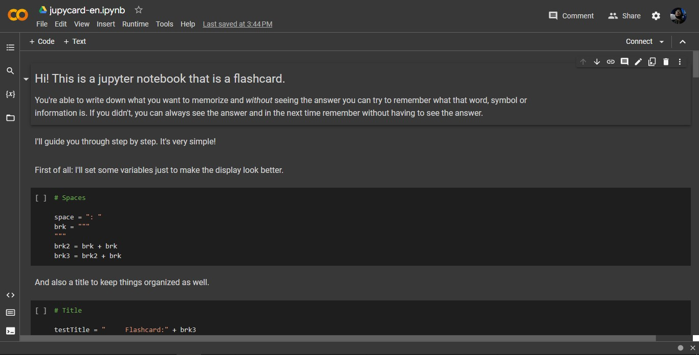

<h1 align="center"> Jupycard</h1>

<h4>Have trouble memorizing anything? Jupycard is a flashcard in Jupyter Notebook, perfect for memorization.</h4>

[Leia em português](./portuguese/readme-pt-br.md)

<h2>Content</h2>

- [Jupycard](#jupycard)
- [Demo](#demo)
    - [Downloading the file directly](#downloading-the-file-directly)
    - [Creating a copy of the original file](#creating-a-copy-of-the-original-file)
    - [Forking this repository](#forking-this-repository)
- [Contibution](#contribution)
- [License](./license.md)

 

## Jupycard:

To use Jupycard, it's very simple. You can:

1. **Download the file** and open it where suits you best: like Google Colab, Jupyter, VS Code and others;

2. **[Go directly](https://colab.research.google.com/drive/15n4szAatgZnPKI4pAdXCmKEUJBiQp1Uk?usp=sharing)** to the file on Google Colab*;

3. **Fork this repository** and alter the file directly anywhere you want (such as in Colab or VS Code).

*: *For option 2, you will have to make your personal copy of the flashcard, so you can use it freely.*

 

## Demo:

### Downloading the file directly:
 

Click on the green *Code* button:

 

Then click *Download ZIP*. You should download a folder.

 

Go to [Google Colaboratory](https://colab.research.google.com). You will end on this page:

Be sure to log in with your google account!

 

Click on *File*, then *Upload Notebook*:

Select the desired *.ipynb* file, and you are ready to go!

 
 

### Creating a copy of the original file:
 

Go to the file. You will see this:

 

Click on *File*, then choose the save option that best suits you:

Congrats, you have your own personal flashcard!

 
 

### Forking this repository:
 

Click on the *Fork* button, then on *Create a new fork*:

 

Give it a name, a description if you want, and then click on *Create fork*:

 

Go to [Google Colaboratoy](https://colab.research.google.com) and click on *GitHub*:

Click on *Include private repos.*

 

When you do it, it will open a pop-up asking for GitHub authorization:

Log in on GitHub and authorize Google Colab.

 

After giving authorization, you will see this:

Select the repository you just forked and you are good to go!

 

## Contribution:
Feel free to contribute to this project! It's far from perfect and I really appreciate your help! You can also share it with your friends or give it a star. **Thank you so much!**
